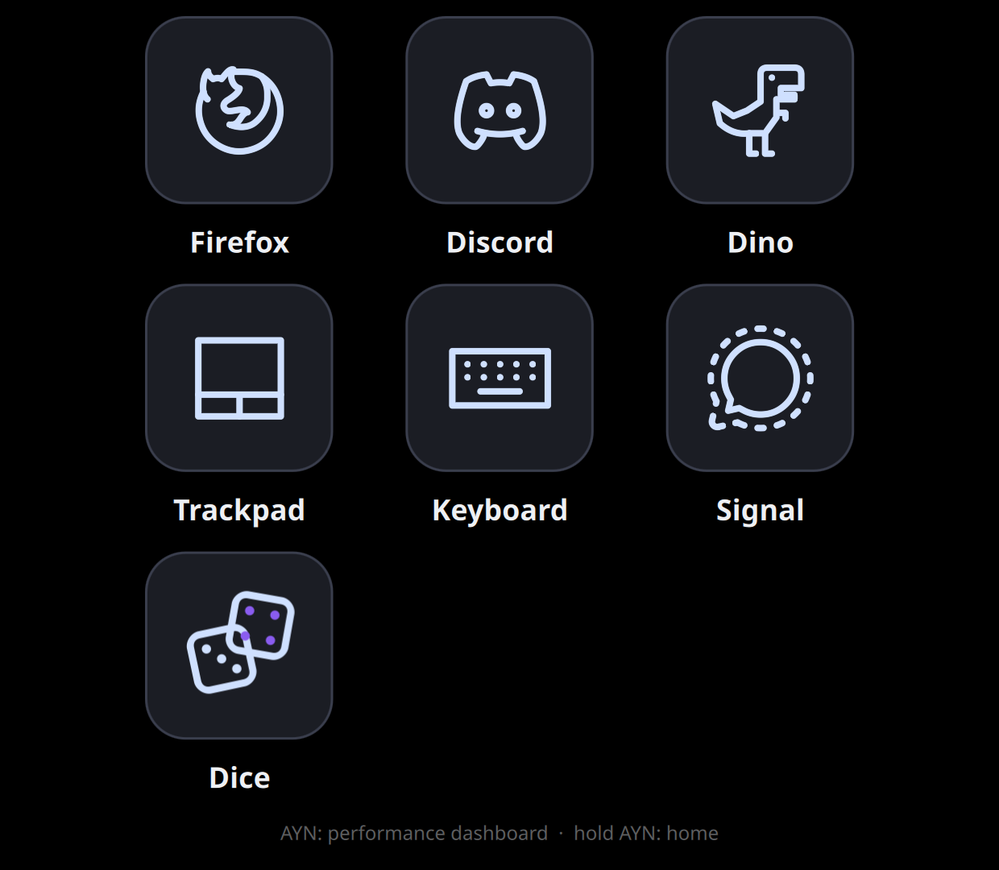

# Barry Launcher apps

> [!IMPORTANT]
> **This repo was built with a coding agent: [Claude Code](https://www.anthropic.com/claude-code),
> running Anthropic's Claude Opus 5.5 (`claude-opus-5-5`).** Claude wrote the
> code, the commit messages and this README. People set the goals, made the
> decisions and did the hands-on testing. Review the code before you rely on
> it. See [a note from lavachemist](https://github.com/project-barry), a human, on Project Barry and generative AI.

Make your own apps for **Barry Launcher**, the home screen on the AYN Thor's
bottom screen in [PB-OS](https://github.com/project-barry/pb-os) (and in the
[portable Barry Launcher](https://github.com/project-barry/barry-launcher)).

A Barry Launcher app is a folder with a QML file and a small
`barry-app.json`, or just the `barry-app.json` of a website (a web app). Zip the folder, install the zip from Barry Launcher's
Decky plugin, and the app gets its own tile on the home screen.



## What's here

| Folder | |
| --- | --- |
| [`apps/dice`](apps/dice) | **Dice**, the example app: up to six dice, d4 to d20, with a tumble-and-bounce roll. Shows sizing, touch, animation and saving settings. |
| [`apps/whatsapp`](apps/whatsapp) | **WhatsApp**, a web app: WhatsApp Web in a Firefox window of its own, logged in between runs. No code, just `barry-app.json`; the example for [web apps](https://github.com/project-barry/barry-launcher-apps/wiki/Web-Apps). Not made by WhatsApp or Meta. |
| [`apps/claude`](apps/claude) | **Claude**, a web app: claude.ai in a Firefox window of its own, with your own account, chats and voice input. Not made by Anthropic. |
| [`apps/dino`](apps/dino) | **Dino**, the endless runner that comes with Barry Launcher, here to install again if you removed it. A whole game in one QML file. |
| [`template`](template) | A bare starting point: copy it, rename it, build on it. |
| [`tools`](tools) | `barry-app check`, `pack` and `run`: check an app, zip it, and try it on your computer. |
| [`wiki`](wiki) | The source of [the wiki](https://github.com/project-barry/barry-launcher-apps/wiki). |

Elsewhere: **[Pip-Boy](https://github.com/project-barry/PyPipboyApp/tree/master/barry)**,
Fallout 4's Pip-Boy, lives in its own GPL repository. It's the example for apps with a
[Python service](https://github.com/project-barry/barry-launcher-apps/wiki/Services).

## Try the example

Download `dice.zip`, `whatsapp.zip`, `claude.zip` or `dino.zip` from the
[latest release](https://github.com/project-barry/barry-launcher-apps/releases/latest).
On the Thor, go to Quick Access (•••) → **Barry Launcher** → **Apps** →
**Install app…** and pick the zip.

## Make your own

```sh
cp -r template myapp                     # then set the id and name in myapp/barry-app.json
python3 tools/barry-app run myapp        # try it in a window (needs Qt 6)
python3 tools/barry-app pack myapp       # make the zip to install
```

The wiki explains it all, with pictures:

- [Your first app](https://github.com/project-barry/barry-launcher-apps/wiki/Your-First-App)
- [Installing apps](https://github.com/project-barry/barry-launcher-apps/wiki/Installing-Apps)
- [App package reference](https://github.com/project-barry/barry-launcher-apps/wiki/App-Package-Reference)
- [Web apps](https://github.com/project-barry/barry-launcher-apps/wiki/Web-Apps)
- [The `barry` object](https://github.com/project-barry/barry-launcher-apps/wiki/The-barry-Object)
- [Services (Python)](https://github.com/project-barry/barry-launcher-apps/wiki/Services)
- [Design guidelines](https://github.com/project-barry/barry-launcher-apps/wiki/Design-Guidelines)
- [Tools](https://github.com/project-barry/barry-launcher-apps/wiki/Tools)

## Status

App support is new, so the package format may still grow (its `"format": 1`
says which version an app is written for). Apps run as your user, without a
sandbox: install apps only from people you trust.

## License

MIT (see [LICENSE](LICENSE)): copy the example and the template into your
own apps freely. Dino comes from pb-os and keeps its license (GPL-2.0; see
[its README](apps/dino/README.md), with the credits for the original game). The files in `tools/` come from pb-os and keep its license
for its own scripts, the GNU GPL version 2 (see [tools/README.md](tools/README.md)).
