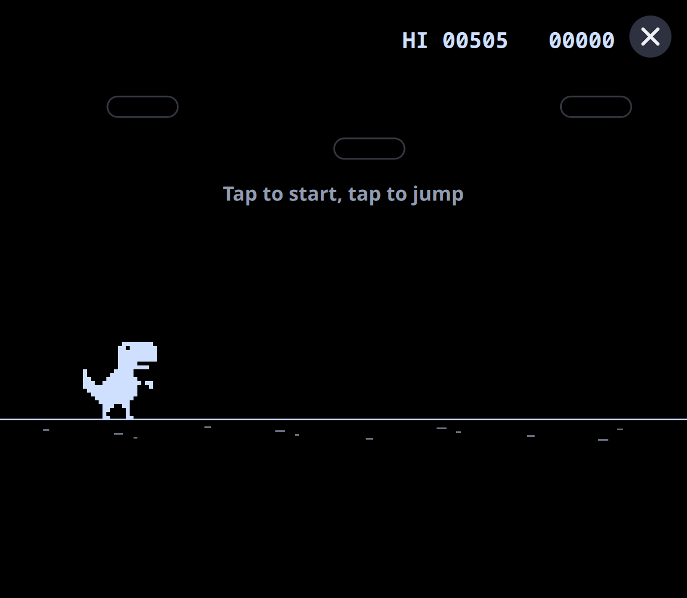

# Dino

An endless runner after Chrome's offline dinosaur game, in Barry Launcher's
colours. Tap to start and to jump; cacti, and birds once the score passes
400. It keeps your best score.

Dino comes with Barry Launcher. If you removed it, install `dino.zip` from
the [latest release](https://github.com/project-barry/barry-launcher-apps/releases/latest)
to get it back. This copy follows pb-os's
(`sm8550-overlay/usr/share/barry_launcher/apps/dino`).

## Credit

The original is Google Chrome's Dinosaur Game ("Lonely T-Rex", 2014) by
**Sebastien Gabriel, Alan Bettes and Edward Jung** of Google's Chrome team.
Its source is in Chromium, BSD-licensed, © The Chromium Authors:
[components/neterror/resources/dino_game](https://source.chromium.org/chromium/chromium/src/+/main:components/neterror/resources/dino_game/).
This version is written anew in QML; it has no Chromium code and none of
Chrome's sprite images.

## License

Dino is part of pb-os and keeps its license, the
[GNU GPL version 2](https://www.gnu.org/licenses/old-licenses/gpl-2.0.html),
unlike the MIT-licensed example and template in this repository.
